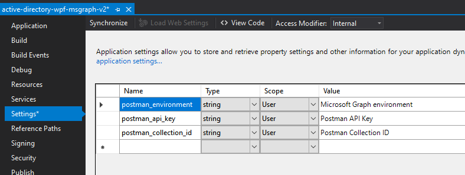
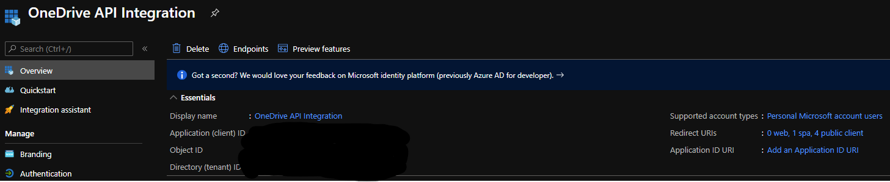
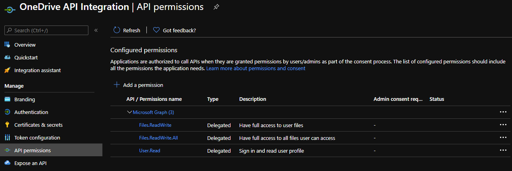

# Postman OneDrive Graph API Integration

## Introduction
While working on recent projects with limited drive space, I realized that it would be good to have a drive back up which contains the code files. Also, while working on couple of javascript projects, it would make more sense to sync the projects folders with some exclusion. Current OneDrive app doesn't support exclusion of sub-folders but Graph API supports the upload of a single file or files. With Postman Collection, it is possible to only sync the files/folders you need. You can create/delete folders, upload files using this collection.

## How it works?

### Pre-Requisites

I have added code change to this application such that once it receives token form Azure token endpoint, it updates the collection variable with the same using postman api (which requires API Key). 

You need to update the Setting keys for the project active-directory-wpf-msgraph-v2.

### Accessing Application

1. I am using a auto-generated application (for windows desktops/WPF app) to handle Azure Authentication. Run the application and click on Call MicrosoftGraphApi button. This will make auth request and on successful authentication and authorization, it updates collection variable for a provided collection id.
2. Now, inside Postman App, access the collection named "MyOneDriveAPICollection". _Please note that first of all, you have to run script "01 Get current user info". Reason behind is, current value for Postman collection variables can't be updated using API. Update call only sets Initial Value for Collection variables. I have added pre-request script, which updates current value for "AccessToken" to the one we updated in step#1. This AccessToken variable is passed in header as Bearer Token while making rest of the API Calls._  

### Azure App Setup

1. Create an Azure application with supported account types as Microsoft Personal Accounts. Add appropriate Redirect URIs for desktop application.
   
   
2. Give the necessary application permission to this app in order to create/delete the files for user.
   
   

### Demo
---

### Author
---
#### Tapan Patel 
